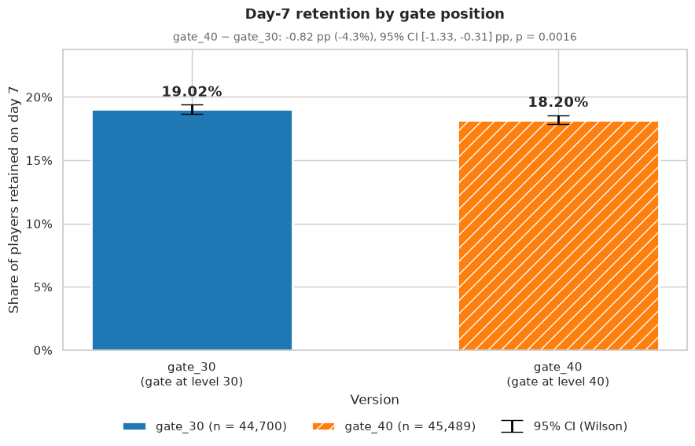
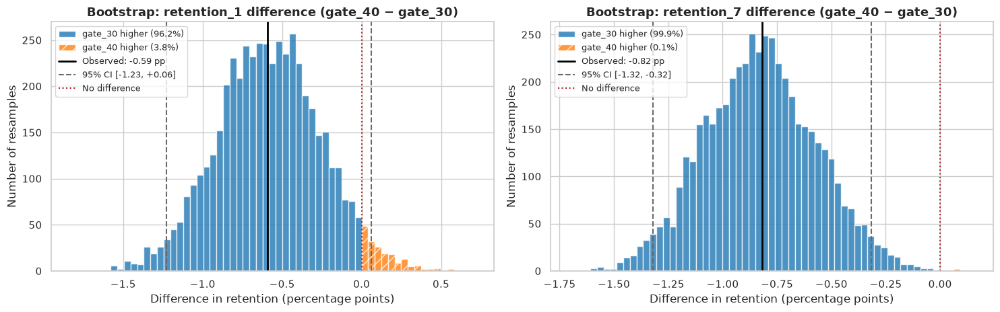

# Cookie Cats A/B Test: Gate at Level 30 vs Level 40

[](https://colab.research.google.com/github/AbenyT/cookie-cats-A-B/blob/claude/cookie-cats-ab-test-thijdf/cookie_cats_ab_test.ipynb)

An A/B test analysis of the mobile puzzle game **Cookie Cats**. Players hit "gates" that make them wait or pay before they can continue. The test moved the first gate from **level 30** (`gate_30`, control) to **level 40** (`gate_40`, treatment). This notebook asks whether that move changed player retention and engagement, and where the gate should sit.

## Result

**Keep the first gate at level 30.** Moving it to level 40 significantly lowers 7-day retention.

| Metric | Role | gate_30 | gate_40 | Difference (gate_40 − gate_30) | 95% CI | p-value | Holm-adjusted p | Verdict |
|---|---|---|---|---|---|---|---|---|
| **7-day retention** | primary | 19.02% | 18.20% | **−0.82 pp (−4.3%)** | [−1.33, −0.31] pp | 0.0016 | – | **Significant: gate_40 lower** |
| 1-day retention | secondary | 44.82% | 44.23% | −0.59 pp (−1.3%) | [−1.24, +0.06] pp | 0.0744 | 0.1004 | Not significant |
| Rounds played (median) | secondary | 17 | 16 | −1 round | [−1, 0] | 0.0502 (Mann-Whitney) | 0.1004 | Not significant |

- **Impact:** per 100,000 installs, the level-40 gate keeps about **820 fewer players on day 7** (95% CI 312 to 1,328).
- **Robustness:** all 8 checks on 7-day retention agree. These are the z-test, chi-square, Fisher's exact test, bootstrap, permutation test and Bayesian analysis, plus reruns without the outlier and with capped rounds.
- **Bayesian view:** there is a 99.9% posterior probability that `gate_30` has the higher 7-day retention.
- **Power:** the minimum detectable effect at 80% power is about 0.73 pp. The observed 0.82 pp effect is above it, so the test had enough data for an effect this size.





## Data

`cookie_cats.csv` has 90,189 players, one row each. The file is **not included** in this repo.

| Column | Description |
|---|---|
| `userid` | Unique player ID |
| `version` | `gate_30` (control) or `gate_40` (treatment) |
| `sum_gamerounds` | Rounds played in the first 14 days after install |
| `retention_1` | Whether the player returned 1 day after install |
| `retention_7` | Whether the player returned 7 days after install |

Known issues and how the notebook handles them:

| Issue | Handling |
|---|---|
| Unequal groups (44,700 vs 45,489) | Sample ratio mismatch test. It is significant at 0.05 (p = 0.0086) but not at the stricter 0.001 cutoff, so it is reported as a caveat. |
| One extreme outlier (49,854 rounds; the next highest is 2,961) | Kept in the main analysis. Two sensitivity datasets remove it or cap rounds at the 99.9th percentile. |
| About 4.4% of players have 0 rounds | Kept, because they were randomized |
| `sum_gamerounds` is measured after treatment | Never used to filter the main analysis |

## Method

The analysis keeps every randomized player (intention-to-treat), uses α = 0.05 with two-sided tests, and reports 95% confidence intervals. Seed 42 is used for every bootstrap and permutation step.

| Part | Content |
|---|---|
| 1. Setup | Imports, plot style, Google Drive mount, data loading |
| 2. Data integrity | Types, unique IDs, missing values, duplicates, value checks, data quality log |
| 3. Experiment validity | Sample ratio mismatch chi-square test, zero-round check, cross-table of `retention_1` vs `retention_7` |
| 4. EDA | Descriptive table, log-scale histogram and ECDF, top values, churn curve, retention by rounds bucket |
| 5. Outlier handling | Sensitivity datasets: outlier removed, and rounds capped at the 99.9th percentile |
| 6. Retention tests | Two-proportion z-test and chi-square, pp difference and relative lift with 95% CIs |
| 7. Engagement test | Mann-Whitney U, bootstrap CIs for the difference in means and medians |
| 8. Bootstrap retention | 5,000 resamples, distributions, share of resamples where `gate_30` is higher |
| 9. Uncertainty and robustness | Minimum detectable effect and power curve, permutation test, Bayesian beta-binomial with expected loss, sensitivity reruns, robustness table |
| 10. Multiple comparisons | Holm correction for the secondary metrics, final results table with verdicts |
| 11. Conclusion | Headline chart, impact per 100,000 installs, findings, limitations, recommendation |

Every printed interpretation and verdict is computed from the data, never typed in by hand, so the notebook also works on a different export of the same table.

## Limitations

- **No revenue data.** A later gate may change in-app purchases or ad views, which retention does not capture.
- **Rounds are not levels.** `sum_gamerounds` includes replays, so who actually reached level 30 or 40 is not observed.
- **14-day window.** Longer-term retention and lifetime value may differ.
- **Sample ratio mismatch.** The split is slightly off 50/50 (p = 0.0086). Zero-round shares are similar across groups (p = 0.17), but an assignment or logging problem cannot be ruled out.
- **Single test.** The results come from one experiment on one player cohort.

## How to run

1. Upload `cookie_cats.csv` to your Google Drive.
2. Open `cookie_cats_ab_test.ipynb` in [Google Colab](https://colab.research.google.com/). Use the badge above if the repo is public, or use **File → Upload notebook**.
3. If needed, edit `DATA_PATH` in cell 1.1. The default is `/content/drive/MyDrive/cookie_cats.csv`.
4. Choose **Runtime → Run all** and approve the Drive mount when asked. The full run takes about 1–2 minutes; Part 9 is the slowest.

Only libraries that come with Colab are used: `pandas`, `numpy`, `scipy`, `statsmodels`, `matplotlib`, `seaborn`.

## Repository structure

```
.
├── cookie_cats_ab_test.ipynb   # The full analysis notebook (Parts 1–11)
├── images/                     # Charts used in this README
└── README.md
```
